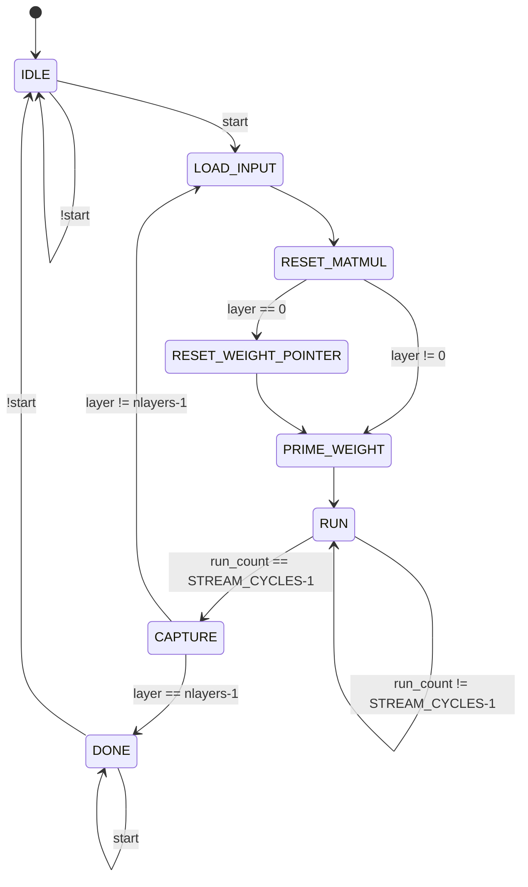

# Accelotl (WIP)


Hardware neural network accelerator with systolic array architecture in SystemVerilog.

## Modules

| Module            | Description                       |
| ----------------- | --------------------------------- |
| `mac.sv`          | Multiply-accumulate               |
| `matmul.sv`       | N×N systolic array                |
| `weight_store.sv` | Column-addressable weight memory  |
| `queue.sv`        | Shift register with parallel load |
| `accel.sv`        | Top-level controller with FSM     |

## Building

```bash
make mac
make matmul
make queue
make combined
make accel
```

**Requirements:** Icarus Verilog, GTKWave (optional)

## Design Notes

- TODO: Uniform quantization with configurable `SCALE_SHIFT` parameter
- Integer-only control path works for two back-to-back `64x64` matmuls.
- Weights load while `accel` is idle.
- Weights are stored in padded/skewed stream order.
- `STREAM_CYCLES = 2*NEURONS - 1`.
- `LAYERS` is hardware capacity.
- `nlayers` is the active model depth.
- Layer output feedback currently truncates to `WIDTH`.

## FSM



| State | `done` | `le` | `acce` | `re` | `shifte` | `wreset` | `mreset` | `qreset` |
| --- | ---: | ---: | ---: | --- | ---: | ---: | ---: | ---: |
| `IDLE` | 0 | 0 | 0 | 0 | 0 | 1 | 1 | 1 |
| `LOAD_INPUT` | 0 | 1 | 0 | 0 | 0 | 0 | 1 | 0 |
| `RESET_MATMUL` | 0 | 0 | 0 | 0 | 0 | 0 | 1 | 0 |
| `RESET_WEIGHT_POINTER` | 0 | 0 | 0 | 0 | 0 | 1 | 1 | 0 |
| `PRIME_WEIGHT` | 0 | 0 | 0 | 1 | 0 | 0 | 0 | 0 |
| `RUN` | 0 | 0 | 1 | `run_count < STREAM_CYCLES-1` | 1 | 0 | 0 | 0 |
| `CAPTURE` | 0 | 0 | 0 | 0 | 0 | 0 | 0 | 0 |
| `DONE` | 1 | 0 | 0 | 0 | 0 | 0 | 0 | 0 |
